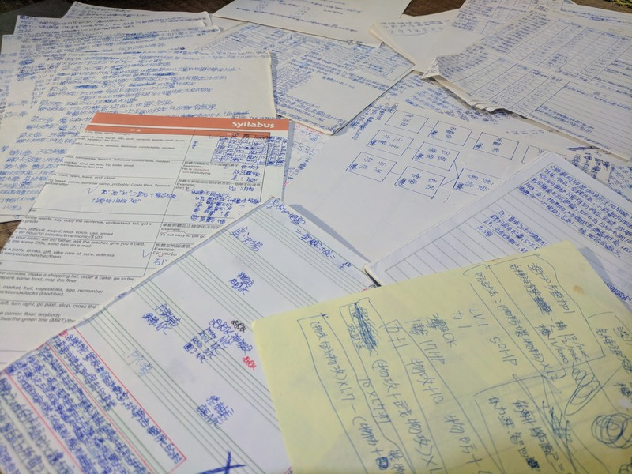
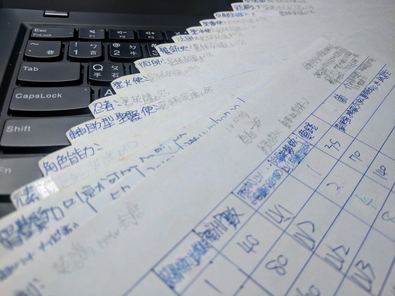
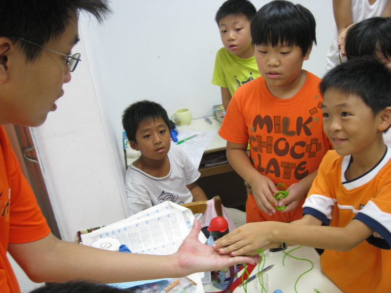
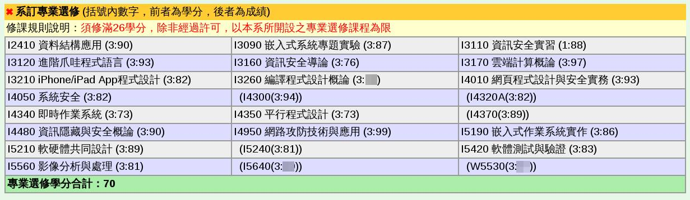
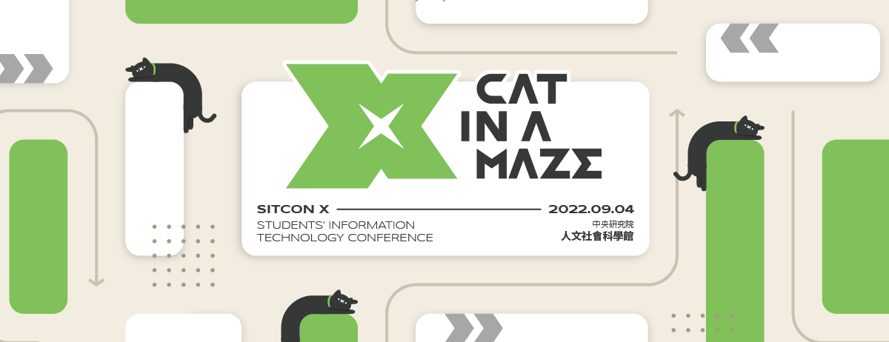

<!-- Google tag (gtag.js) -->

<!-- _paginate: false -->

# 被演算法推薦的人生？ 資訊科技世代的生涯選擇與逃避自由

 
 
 
 

## Denny Huang
### 2025/12/03 @竹科實中

---

# 簡報 & Slido
<a href="https://app.sli.do/event/8g5fMoBNrbj468GURSHF4b" target="_blank">Join Slido</a>

---

<iframe src="https://wall.sli.do/event/8g5fMoBNrbj468GURSHF4b/?section=830bc948-dd74-4b73-8416-cd765e51a75c" height="100%" width="100%" frameBorder="0" style="min-height: 560px;" allow="clipboard-write" title="Slido"></iframe>

---

# Denny Huang

- <a href="https://sitcon.org/" target="_blank">SITCON 學生計算機年會</a> 共同發起人
- <a href="https://coscup.org/" target="_blank">COSCUP 開源人年會</a> 長期志工
- <a href="https://hitcon.org/" target="_blank">HITCON 台灣駭客年會</a>  長期志工
- 曾任雷亞遊戲（Rayark Inc.） 資料分析團隊主管
- 開放原始碼/資訊安全社群活躍參與者
- <a href="https://denny.one/" target="_blank">About me</a>

---

# 迷茫、焦慮的世代
- 面對未來的不確定性
- 資訊爆炸、選擇過多
- 社群媒體的影響
- AI 技術的快速發展
- 社會期待與自我認同的衝突

---

# 佛洛姆《逃避自由》

---

<iframe src="https://wall.sli.do/event/8g5fMoBNrbj468GURSHF4b/?section=830bc948-dd74-4b73-8416-cd765e51a75c" height="100%" width="100%" frameBorder="0" style="min-height: 560px;" allow="clipboard-write" title="Slido"></iframe>

---

# 夢想

---

# 國中畢業紀念冊

---

# 國小設計遊戲

---

# 國中課本

---

# 人家在準備考高中，我在…

---

# 社團

---

# 第一份打工

---

# 大學沒畢業

---

# 社群
- [SITCON 學生計算機年會](https://denny.one/Intro-SITCON/)
- [開源社群推廣目錄](https://sitcon.org/community-list)
- [SITCON 新人手冊](https://sitcon.org/join)
- [SITCON 社群指南](https://sitcon.org/community-guide/)

---

# 探索自我
<iframe width="80%" height="90%" src="https://www.youtube.com/embed/G381QhInC3Q?rel=0&amp;controls=0&amp;showinfo=0&amp;" frameborder="0" allow="autoplay; encrypted-media" allowfullscreen></iframe>

---

# SITCON X: [Cat in a Maze](https://sitcon.org/2022/)

---

# SITCON 2025: [Lines of Flight 逃逸路線](https://sitcon.org/2025/)

---

# 胎死腹中的計畫
## [Hacker School](https://hackerschool.tw)

---

# 行動！

---

# 被推薦不是罪，不檢查就照做才是。

---

# 與 AI 共事
- 審慎查證，如果有不肯定的資訊請上網查詢，若沒辦法完全肯定請告訴我確認的事實，以及哪些是你的推測
- 我們的討論當中請給我多方觀點，讓我能夠權衡多方利害關係人關係

---

<iframe src="https://wall.sli.do/event/8g5fMoBNrbj468GURSHF4b/?section=830bc948-dd74-4b73-8416-cd765e51a75c" height="100%" width="100%" frameBorder="0" style="min-height: 560px;" allow="clipboard-write" title="Slido"></iframe>

---

# Thanks for listening

 
 

###### 本投影片採用
 <a href="https://creativecommons.org/licenses/by-sa/4.0/deed.zh-hant" target="_blank">創用 CC「姓名標示-相同方式分享 4.0 國際」授權條款</a>釋出
 <a href="https://marp.app/" target="_blank">Marp</a> 製作
